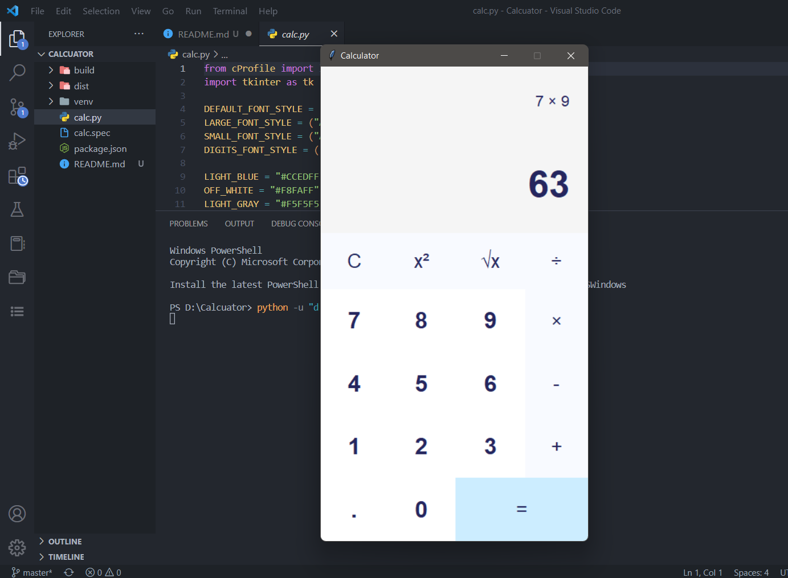

## Calculator

### Calculator with GUI python


**<font size="4">Set up</font>**
```
# python -m venv venv   // create virtual environment
# .\venv\Scripts\activate   // A virtual environment may be “activated” using a script in its binary directory
# pip install pyinstaller // to create executable file
# pyinstaller --onefile -w calc.py // using our program or application as exe
```
**<font size="4">UI</font>**
```
import tkinter as tk
class Calculator:
	def __init__(self):
		self.window = tk.Tk()
		self.window.geometry("375x667")
		self.window.resizable(0,0)
		self.window.title("Calculator")

	def run(self):
		self.window.mainloop()

if __name__ == "__main__":
	calc = Calculator()
	calc.run()
```

**<font size="4">Typing with Keyboard</font>**
```
def bind_keys(self):
	self.window.bind("<Return>", lambda event: self.evaluate())
	for key in self.digits:
		self.window.bind(str(key), lambda event, digit=key: self.add_to_expression(digit))
	for key in self.operations:
		self.window.bind(key, lambda event, operator=key: self.append_operator(operator))
```

**<font size="4">Eval()</font>**

The `eval()` method returns the result evaluated from the `expression`.

Syntax for **eval()**:
```
eval(expression, globals=None, locals=None)
```
Example:
```
x = 1
print(eval("x + x"))

// 2
```

More details about [eval()](https://www.programiz.com/python-programming/methods/built-in/eval).

`Note:`This project is not mine! Just study and practice from the tutorial.
Video on [Youtube](https://youtu.be/QZPv1y2znZo)!